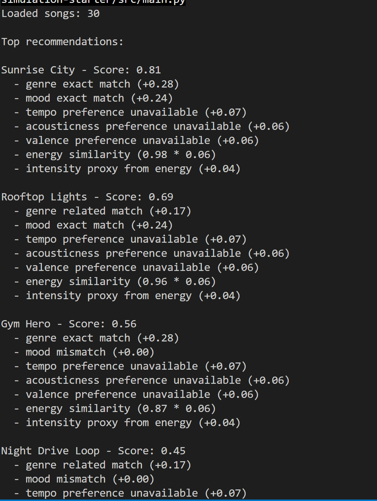
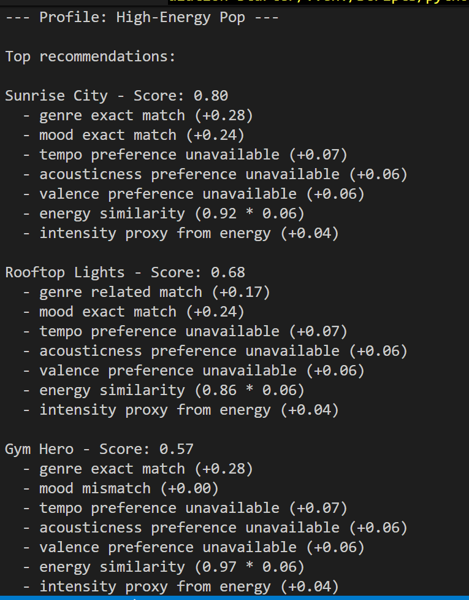
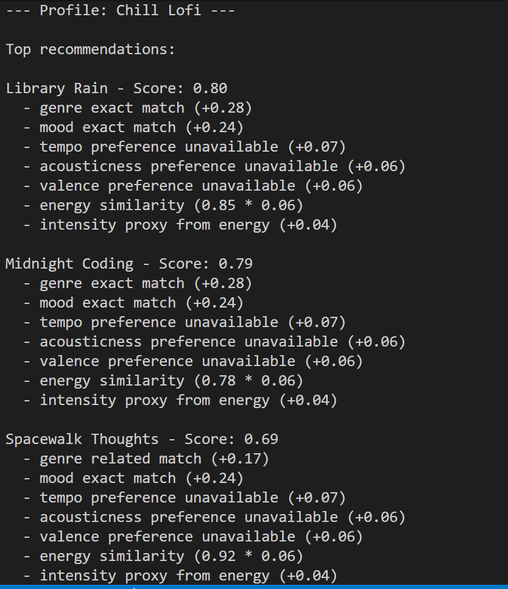
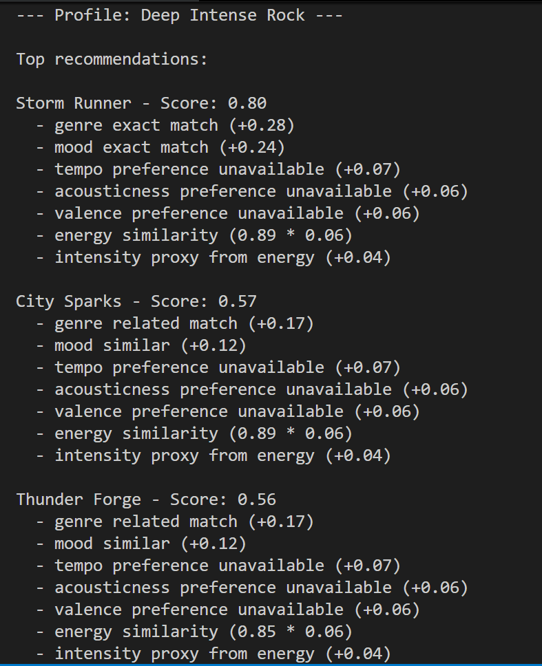

# 🎵 Music Recommender Simulation

## Project Summary

In this project you will build and explain a small music recommender system.

Your goal is to:

- Represent songs and a user "taste profile" as data
- Design a scoring rule that turns that data into recommendations
- Evaluate what your system gets right and wrong
- Reflect on how this mirrors real world AI recommenders

Replace this paragraph with your own summary of what your version does.

---

## How The System Works

Algorithm recipe:

favorite_genre
favorite_mood
preffered_tempo
preferred_acousticness
preferred_valence
target_energy = audio energy level
preferred_intensity = subjective “edge” or aggression of the track

score =
0.28 * genre_score
+ 0.24 * mood_score
+ 0.14 * tempo_score
+ 0.12 * acousticness_score
+ 0.12 * valence_score
+ 0.06 * energy_score
+ 0.04 * intensity_score

How to compute similarity
Genre: exact match = 1.0, related genre family = 0.6, otherwise 0.0
Mood: exact or very close emotion = 1.0, similar mood = 0.5
Tempo/attributes: use distance from preferred value, normalized to 0..1
e.g. tempo_score = 1 - (abs(song_tempo - preferred_tempo) / max_tempo_diff)

Biases:

Genre bias: Putting too much weight on your favorite genre means you keep getting the same old stuff. It might skip cool tracks that fit your mood or energy but come from different genres.

Personalization vs. novelty bias: When genre and mood get all the attention, you miss out on fresh discoveries. The system sticks too closely to what it thinks you like and doesn't suggest anything new.

Cold-start bias: New songs without full info get dinged, even if they'd be perfect. And new users with vague tastes get lousy recommendations because the system needs exact matches.

Mood label bias: Mood tags are super subjective and often inconsistent. If the categories are broad or biased, the recommendations might not match how you actually feel.

Audio feature matching bias: Matching exact audio traits like tempo assumes you want songs that sound identical. This leads to boring playlists that lack variety.

---

## Getting Started

### Setup

1. Create a virtual environment (optional but recommended):

   ```bash
   python -m venv .venv
   source .venv/bin/activate      # Mac or Linux
   .venv\Scripts\activate         # Windows

2. Install dependencies

```bash
pip install -r requirements.txt
```

3. Run the app:

```bash
python -m src.main
```

### Running Tests

Run the starter tests with:

```bash
pytest
```

You can add more tests in `tests/test_recommender.py`.

---

# Initally running main.py

Top results match what I would expect for "pop/happy"



## Experiments You Tried

Experiment: Weight Shift: Double the importance of energy and half the importance of genre.

The weight shift made the recommendations different rather than necessarily more accurate. By doubling energy importance and halving genre importance:

High-energy profiles now prioritize songs with better energy matches over exact genre matches
Low-energy profiles show less emphasis on genre, allowing mood and energy to play larger roles
Conflicting preferences (like high energy + sad mood) maintain similar rankings but with adjusted scores
Extreme cases (like high energy + classical) now surface high-energy songs from other genres that were previously ranked low
The changes are most noticeable in profiles where energy and genre preferences conflict, where energy now has more influence on ranking. Whether this is "more accurate" depends on the user's actual listening preferences - the experiment demonstrates how weighting affects recommendation relevance.







---

## Limitations and Risks

Songs that match genre are well picked, however there is a limitation with the energy attribute.

---

## Reflection

Read and complete `model_card.md`:

[**Model Card**](model_card.md)

Building a music recommender showed me how these systems take user preferences and song details, sort them through formulas to score matches, and spit out suggestions. Using different attributes from each song like genre, mood, and audio vibes helps in predicting what the user may like next. But the tricky part is the biases—stuff like over-relying on genres can trap you in the same loop, or mood tags being subjective might not capture how you really feel, leading to unfair misses on great songs.


---

## 7. `model_card_template.md`

Combines reflection and model card framing from the Module 3 guidance. :contentReference[oaicite:2]{index=2}  

```markdown
# 🎧 Model Card - Music Recommender Simulation

## 1. Model Name

Give your recommender a name, for example:

> VibeFinder 1.0

---

## 2. Intended Use

This recommender suggests songs that match what you like in music. It looks at your favorite genre, mood, and energy level to find good matches.  
The system scores songs by how well they match your preferences. Genre and mood are the biggest factors. Then it checks tempo, how acoustic it is, and energy level. Songs that match closer get higher scores. 


---

## 3. How It Works (Short Explanation)

It looks at each song's genre, mood, tempo, how acoustic or upbeat it is, energy level, and that edgy feel. For the user, it uses the top picks in genre, mood, and those same traits. Then it figures out how close each song matches your tastes—perfect matches get a high score, close ones get medium, and it adds them all up with some weights to pick the best fits.

---

## 4. Data

The dataset has 30 songs. Each song has details like genre, mood, energy, tempo, and more. It covers pop, lofi, rock, and some others. But it might not have all music types out there.


---

## 5. Strengths

It nails it when the user's tastes are very clear, like the loving pop and happy vibes—the top picks just feel spot on. Works great for people with strong genre preferences, and it's super straightforward to see why a song got recommended. So if in the future I wanted to change up the recipe, it would be simple to do so. 

---

## 6. Limitations and Bias

The system sometimes picks songs that match genre well but not energy. For example, it might suggest a high-energy rock song to someone who wants chill pop. This could miss people who care a lot about energy.  

---

## 7. Evaluation

I tested it with different user types like high-energy pop fans and chill lofi lovers. I looked at the top 5 songs for each and checked if they matched the genre and energy. Some surprises, like how one intense song kept showing up for happy preferences.  

---

## 8. Future Work

Add more songs to the list. Make energy matching stronger. Let users give feedback to improve algorithm recipe. 

---

## 9. Personal Reflection

I was surprised how tweaking the weights could totally flip the recommendations, like making energy way more important than genre. Building this made me think about just how much more complicated the algorithms for real music apps are as well as the biases that come with it. I will definetly keep this project in mind the next time I get irritated when spotify recommends me a song that does not fit my taste at all. Even with all the smarts, human judgment still rules for catching those weird mismatches or understanding why a song just clicks for someone.

